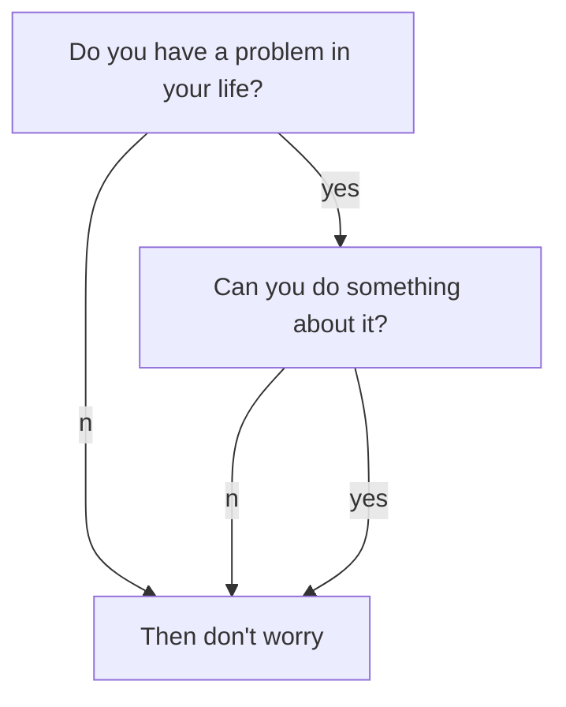

之前也是用过很多博客的模板，但是在GitHub上支持的模板一直没有找到能支持公式编辑的，而之后是在[netlify](https://www.netlify.com/)整理出了自己关于学习中的一些笔记，但是那个网站上面不能显示图片，很多笔记的信息没有办法展示，而在Github上的只是用来写写关于生活的内容。而现在这个博客模板完全可以让我把两个博客的内容合并到一起，而且对公式的支持比用过的其它模板都要给力的多，最终决定花点时间来用这个模板作为自己的博客基础，从而来整理学习与生活内容。
{:.info}

<div></div>
<!--more-->
# 公式支持
薛定谔方程$H\psi=E\psi$

# 图片支持


# 流程图支持


# Chart
```chart
{
  "type": "polarArea",
  "data": {
    "datasets": [
      {
        "data": [
          11,
          16,
          7,
          3,
          14
        ],
        "backgroundColor": [
          "#FF6384",
          "#4BC0C0",
          "#FFCE56",
          "#E7E9ED",
          "#36A2EB"
        ],
        "label": "My dataset"
      }
    ],
    "labels": [
      "Red",
      "Green",
      "Yellow",
      "Grey",
      "Blue"
    ]
  },
  "options": {}
}
```
# 网易音乐插入
<div></div>
# b站视频插入
<div></div>

# pdf插入

[手册](/assets/pdf/H1.pdf)

# 公众号
相关内容均会在公众号进行同步，若对该Blog感兴趣，欢迎关注微信公众号。
{:.info}

<table>
  <tr>
    <!-- 图片单元格 -->
    <td style="width: 300px; height: 300px; text-align: center; vertical-align: middle; border: 1px solid #ccc; border-radius: 8px;">
      
    </td>
    <!-- 文字单元格 -->
    <td style="width: 300px; height: 300px; text-align: center; vertical-align: middle; padding-left: 20px; border: 1px solid #ccc; border-radius: 8px;">
      <div>
        <h4 style="margin: 0;">Email</h4>
        <p style="margin: 5px 0;">yxli406@gmail.com</p>
      </div>
    </td>
  </tr>
</table>